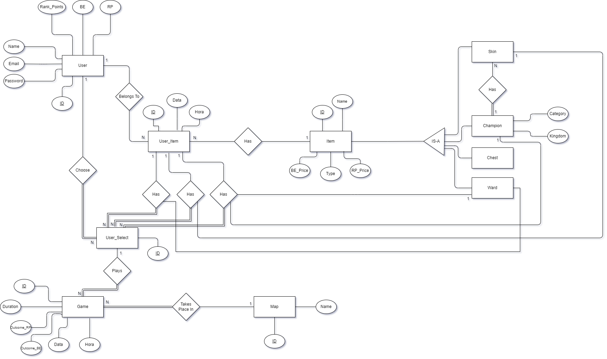
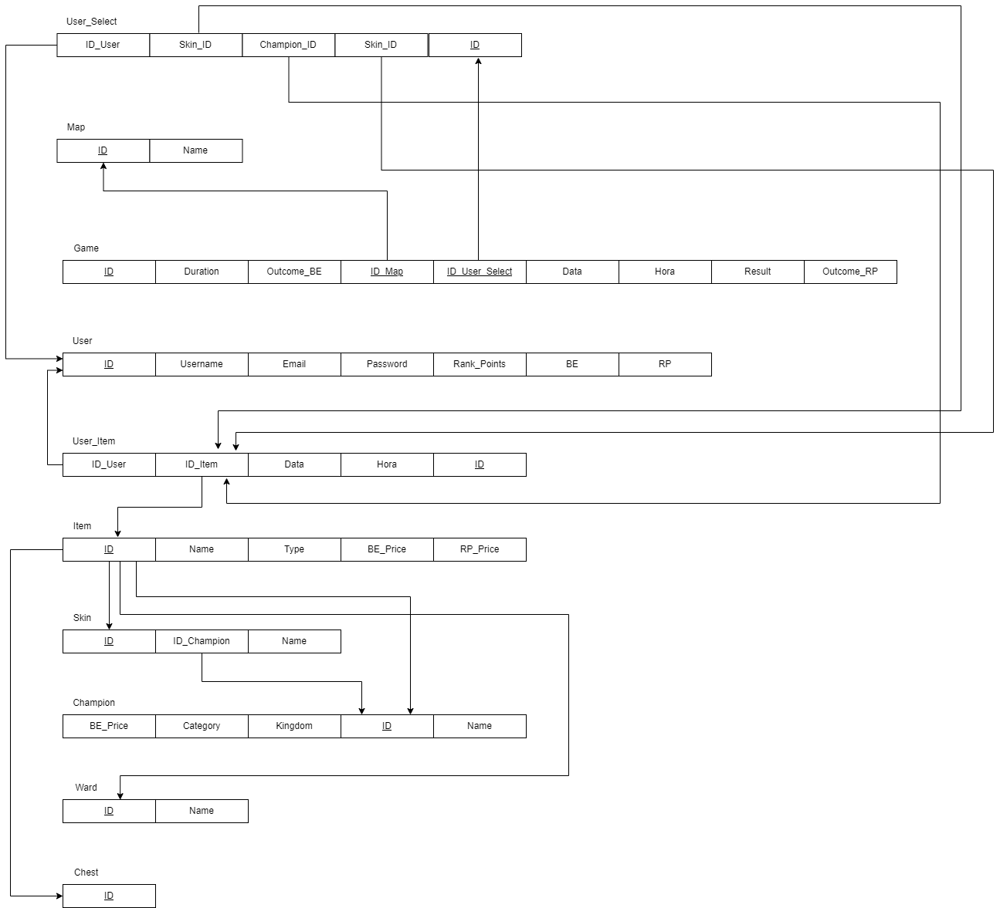
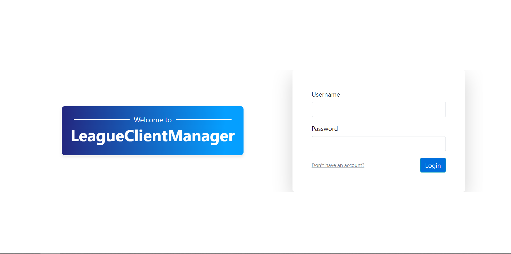
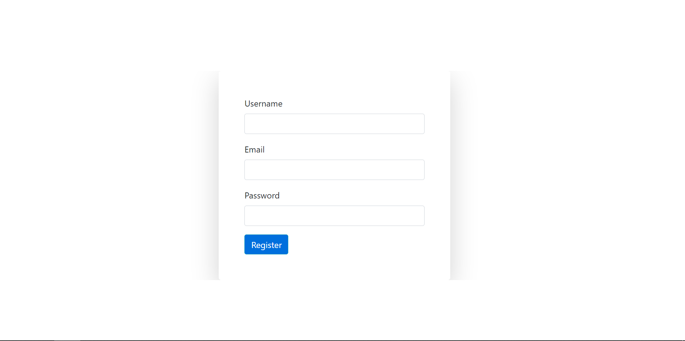
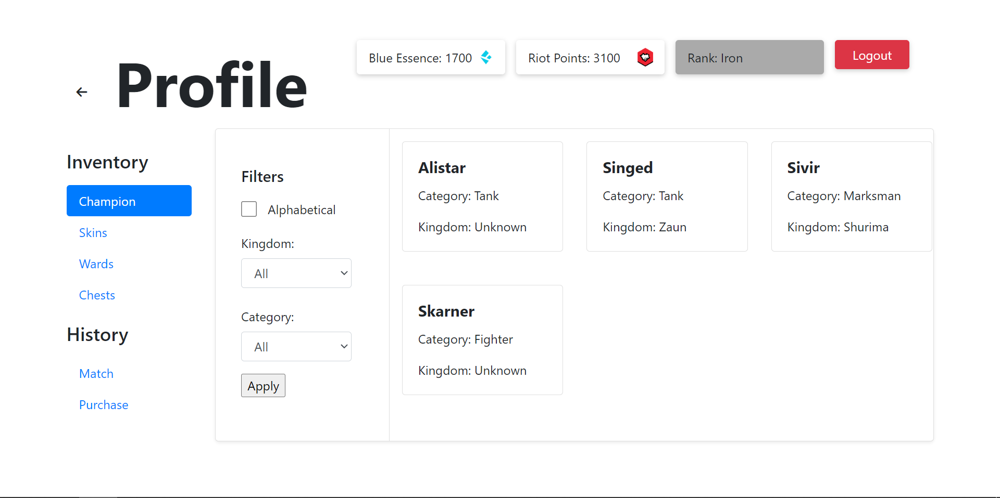
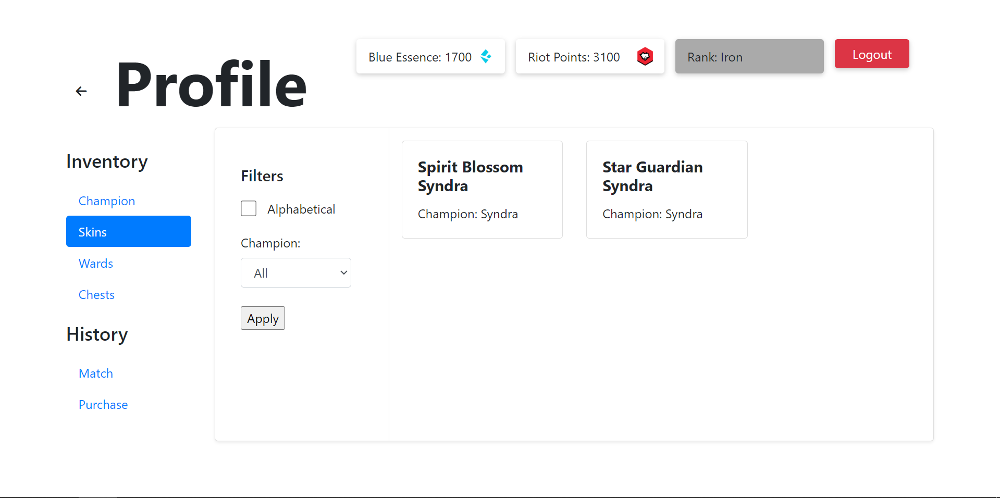
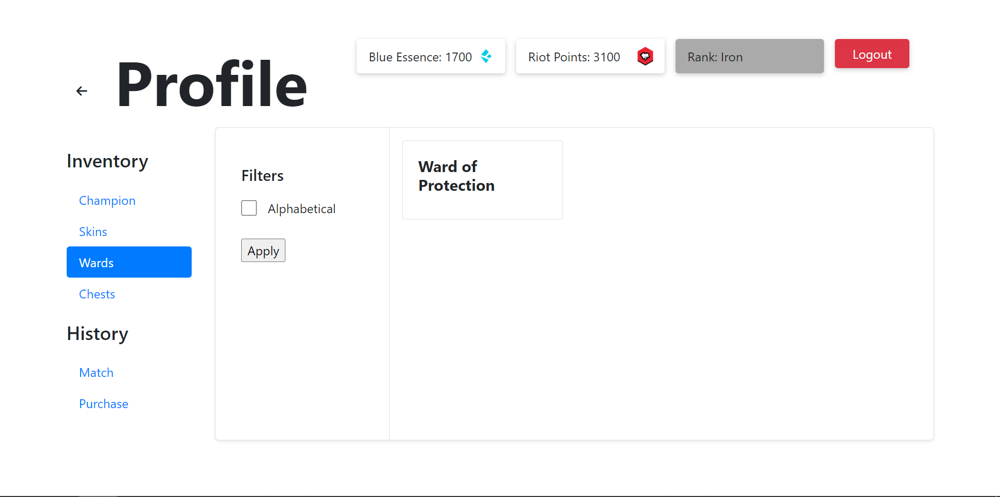
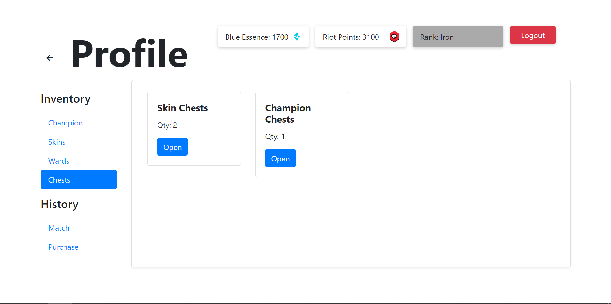
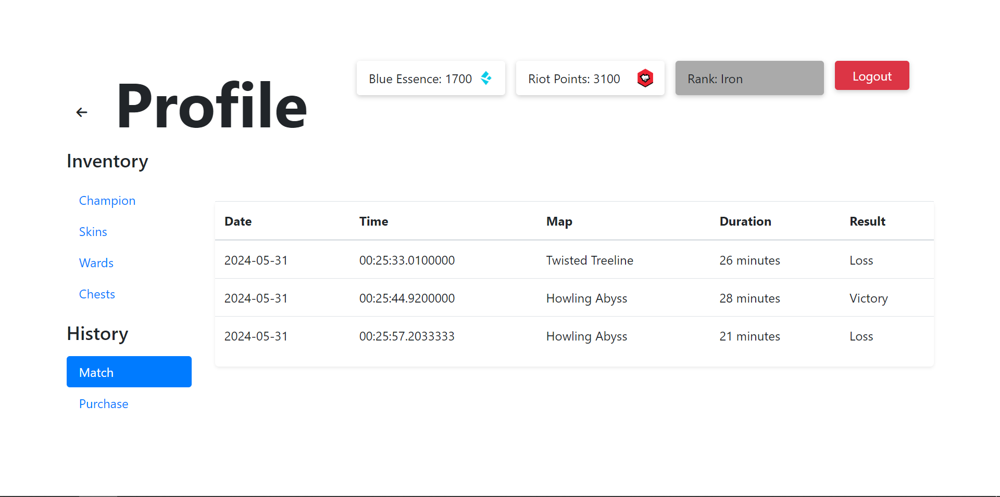
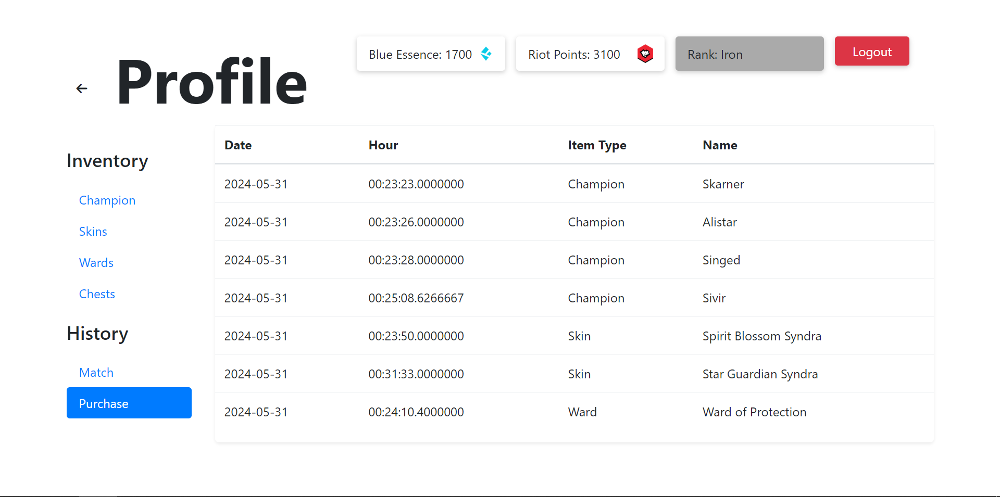

# BD: Trabalho Prático APF-T

**Grupo**: P11G1
- Rui Machado, MEC: 113765
- Martim Santos, MEC: 2000


## Introdução
 
Este projeto tem o objetivo de explorar o universo do jogo “League Of Legends” e ajudar novos jogadores a perceber o funcionamento geral do jogo, que é bastante complexo. Funciona como uma simulação do jogo e dá a conhecer a vasta gama de Champions (personagens), Skins (personalização de champions) e itens do jogo. 

Nesta entrega, incluímos a análise de requisitos, o Diagrama Entidade-Relacionamento, o Esquema Relacional, os ficheiros para a criação e inicialização da base de dados, além dos ficheiros contendo as funções necessárias para realizar consultas, inserções, atualizações e remoções de dados na base. Também fornecemos o código que implementa uma interface para executar todas essas operações.


## ​Análise de Requisitos 

O Utilizador pode…
- Criar uma conta;
- Dar login/logout;
- Visualizar o seu inventário;
- Comprar Champions/Skins/Items;
- Abrir Chests (item), e resgatar um item surpresa;
- Simular a compra da moeda do jogo com dinheiro “real”;
- Aplicar filtros de pesquisa em todas as suas procuras;
- Dar undo (reverter) uma compra feita
- Simular um jogo num mapa escolhido;;
- Visualizar o histórico de compras/jogos;
- Visualizar o seu inventário;
- Aumentar o seu Rank através da simulação de jogos;


## DER - Diagrama Entidade Relacionamento

### Versão final



## ER - Esquema Relacional

### Versão final




## ​SQL DDL - Data Definition Language

[SQL DDL File](sql/01_ddl.sql "SQLFileQuestion")

## SQL DML - Data Manipulation Language

### Login



```sql
-- Uso da SP verifyUser para verificar se as credenciais sao válidas
verifyUser(username, password)
```

### Register



```sql
-- Uso das UDF's getUserByEmail e getUserByUsername para verificar se os valores introduzidos já existem da DB.
getUserByEmail(email)
getUserByUsername(username)
-- Uso do SP createUser para criar o jogador na tabela LCM.[User]
createUser(username, email, password)
-- Uso da UDF HashPassword para encriptar a password
HashPassword(password)
```

### Profile - Top Info Bar



```sql
-- Uso da UDF GetUserInfo para dar display da Blue Essence, Riot Point e Rank presentes na top bar
SELECT * FROM GetUserInfo(user_id)
```


### Profile - Inventory (Filtering)
Filtros usados nas abas Champion/Skins/Wards
```sql
-- Uso da SP  GetFilteredData para fazer a filtragem nas respetivas abas 

 EXEC GetFilteredData @UserID=?, @Type=?, @Alphabetical=?, @Filter1=?, @Filter2=?
    """, (user_id, data_type, alphabetical, kingdom, category))
```

### Profile - Inventory (Champion)


```sql
-- Uso da UDF getChampionByUser para mostar os Champions que pertecem ao inventário do user
SELECT ID, Name, Category, Kingdom FROM GetChampionsByUser(user_id)
```

### Profile - Inventory (Skins)



```sql
-- Uso da UDF getSkinsByUser para mostar as Skins que pertecem ao inventário do user
SELECT ID, skin, championName FROM GetSkinsByUser(user_id)
```

### Profile - Inventory (Wards)



```sql
-- Uso da UDF getWardsByUser para mostar as Warsds que pertecem ao inventário do user
SELECT ID, ward FROM GetWardsByUser(user_id)
```

### Profile - Inventory (Chests)



```sql
-- Uso da UDF getChestsByUser para mostar os Chests que pertecem ao inventário do user
SELECT ID, Name, Category, Kingdom FROM GetChampionsByUser(user_id)
-- Query para ver a quantidade de chests possuidos
SELECT chestsSkin_qty, chestsChampion_qty, chestsWard_qty FROM LCM.[User] WHERE ID = user_id
```

### Profile - History (Match)



```sql
-- Uso da view View_UserGameHistory para ver histórico total de jogos realizados pelo user
SELECT * FROM LCM.View_UserGameHistory ui WHERE ui.ID_User = user_id
```

### Profile - History (Purchase)



```sql
-- Uso da view View_UserPurchaseHistory para ver histórico total de compras realizadas pelo user
SELECT *
FROM LCM.View_UserBuyHistory ui
JOIN LCM.Item i ON ui.ID_Item = i.ID
WHERE ui.ID_User = user_id
```

## Normalização


Ao revermos o nosso sistema, verificámos que este já se encontrava conforme a terceira forma normal. Tal deve-se ao cuidado que tivemos ao analisar o Diagrama de Entidade e Relacionamento (DER) antes de elaborarmos o Esquema Relacional. Desde o início, assegurámo-nos de que as tabelas continham atributos atómicos, evitámos incorporar relações dentro de outras e eliminámos quaisquer dependências parciais.

## Stored Procedures

## Triggers

## UDF

## Indexs

Para melhorar a velocidade das pesquisas de champions e skins, optámos por utilizar índices. Apesar da nossa base de dados ser de tamanho relativamente pequeno, decidimos implementar esta estrutura nessas tabelas devido à sua utillizaçao frequente.

```sql
-- Create an index to speed
CREATE INDEX index_name ON table_name (column1, column2, ...);
```

## Views


 