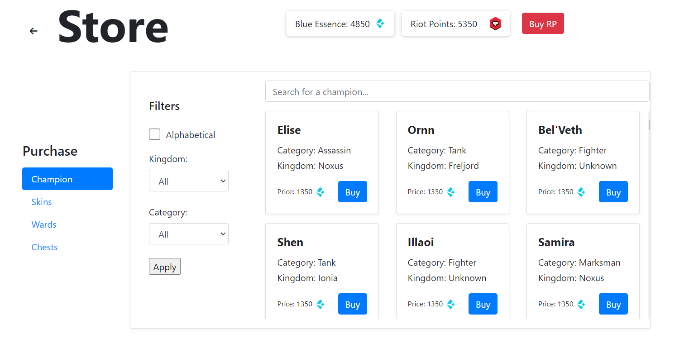
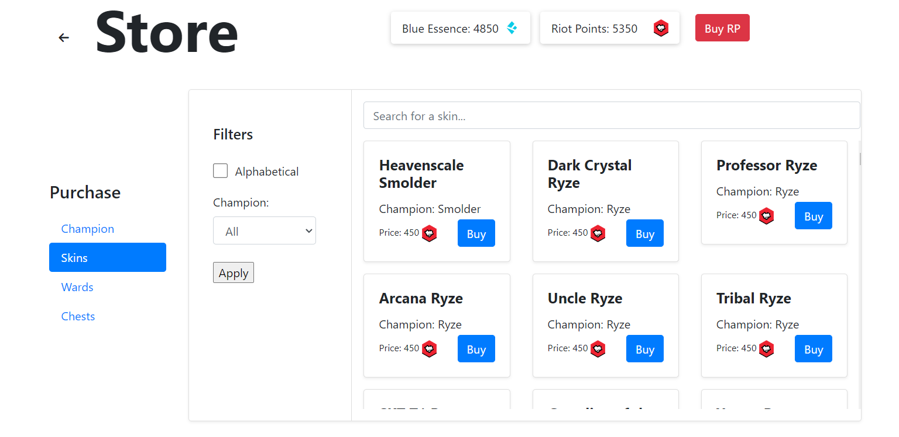
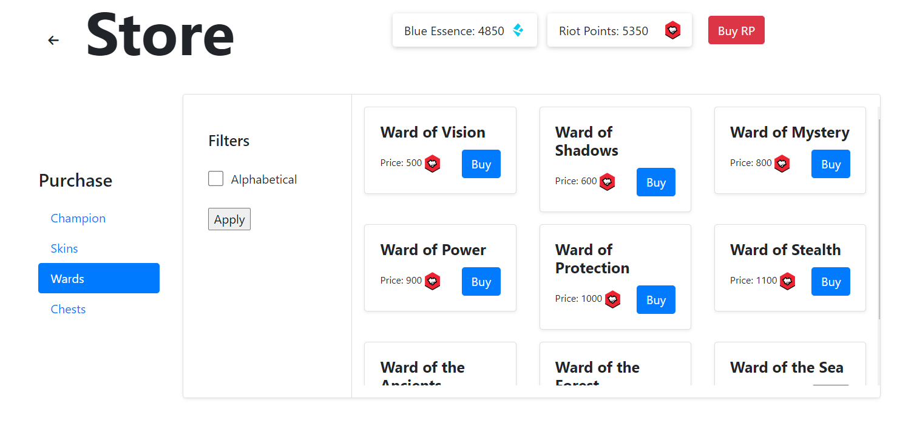
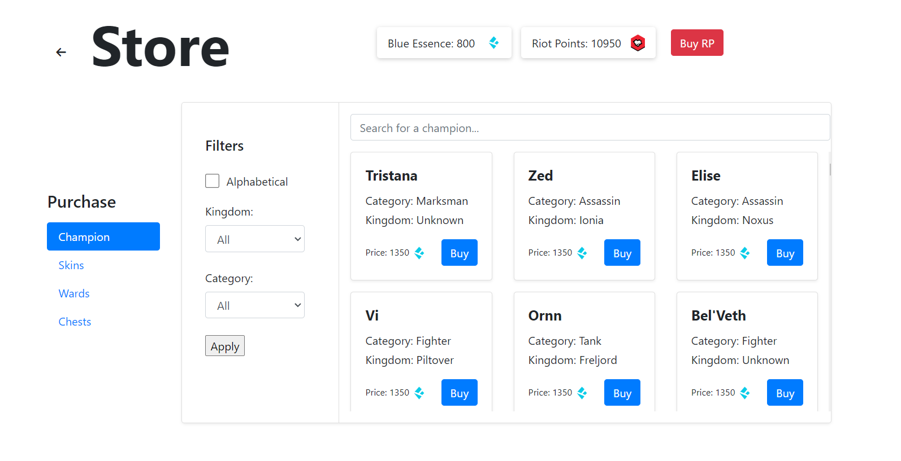
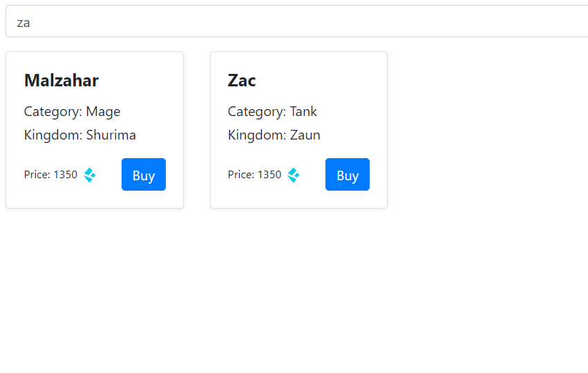
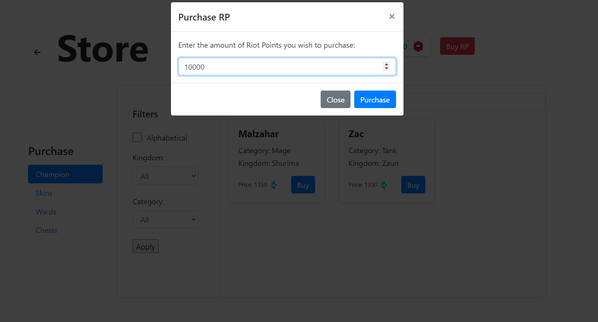
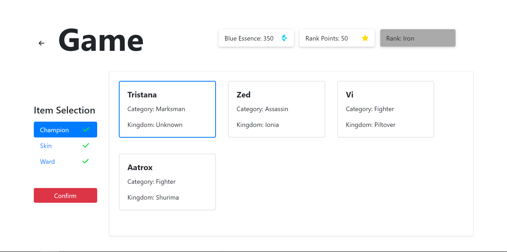
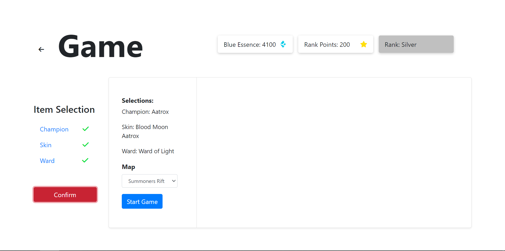
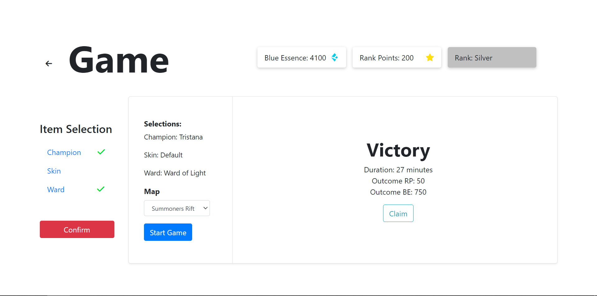

# BD: Trabalho Prático APF-T

**Grupo**: P11G1
- Rui Machado, MEC: 113765
- Martim Santos, MEC: 2000


## Introdução
 
Este projeto tem o objetivo de explorar o universo do jogo “League Of Legends” e ajudar novos jogadores a perceber o funcionamento geral do jogo, que é bastante complexo. Funciona como uma simulação do jogo e dá a conhecer a vasta gama de Champions (personagens), Skins (personalização de champions) e itens do jogo. 

Nesta entrega, incluímos a análise de requisitos, o Diagrama Entidade-Relacionamento, o Esquema Relacional, os ficheiros para a criação e inicialização da base de dados, além dos ficheiros contendo as funções necessárias para realizar consultas, inserções, atualizações e remoções de dados na base. Também fornecemos o código que implementa uma interface para executar todas essas operações.


## ​Análise de Requisitos 

O Utilizador pode…
- Criar uma conta;
- Dar login/logout;
- Visualizar o seu inventário;
- Comprar Champions/Skins/Items;
- Abrir Chests (item), e resgatar um item surpresa;
- Simular a compra da moeda do jogo com dinheiro “real”;
- Aplicar filtros de pesquisa em todas as suas procuras;
- Dar undo (reverter) uma compra feita
- Simular um jogo num mapa escolhido;;
- Visualizar o histórico de compras/jogos;
- Visualizar o seu inventário;
- Aumentar o seu Rank através da simulação de jogos;


## DER - Diagrama Entidade Relacionamento

### Versão final


## ER - Esquema Relacional

### Versão final


## ​SQL DDL - Data Definition Language

[SQL DDL File](../DDL.sql "SQLFileQuestion")

## SQL DML - Data Manipulation Language

### Login


```sql
-- Uso da SP verifyUser para verificar se as credenciais sao válidas
verifyUser(username, password)
```

### Register


```sql
-- Uso das UDF's getUserByEmail e getUserByUsername para verificar se os valores introduzidos já existem da DB.
getUserByEmail(email)
getUserByUsername(username)
-- Uso do SP createUser para criar o jogador na tabela LCM.[User]
createUser(username, email, password)
-- Uso da UDF HashPassword para encriptar a password
HashPassword(password)
```
### Profile 
Nesta página o user tem acesso aos seus dados pessoais, como inventário e histórico. 

#### Profile - Top Info Bar


```sql
-- Uso da UDF GetUserInfo para dar display da Blue Essence, Riot Point e Rank presentes na top bar
SELECT * FROM GetUserInfo(user_id)
```


#### Profile - Inventory (Filtering)
Filtros usados nas abas Champion/Skins/Wards
```sql
-- Uso da SP  GetFilteredData para fazer a filtragem nas respetivas abas 
EXEC GetFilteredData @UserID=?, @Type=?, @Alphabetical=?, @Filter1=?, @Filter2=?
    """, (user_id, data_type, alphabetical, kingdom, category))
```

#### Profile - Inventory (Champion)


```sql
-- Uso da UDF getChampionByUser para mostar os Champions que pertecem ao inventário do user
SELECT ID, Name, Category, Kingdom FROM GetChampionsByUser(user_id)
```

#### Profile - Inventory (Skins)


```sql
-- Uso da UDF getSkinsByUser para mostar as Skins que pertecem ao inventário do user
SELECT ID, skin, championName FROM GetSkinsByUser(user_id)
```

#### Profile - Inventory (Wards)


```sql
-- Uso da UDF getWardsByUser para mostar as Warsds que pertecem ao inventário do user
SELECT ID, ward FROM GetWardsByUser(user_id)
```

#### Profile - Inventory (Chests)


```sql
-- Uso da UDF getChestsByUser para mostar os Chests que pertecem ao inventário do user
SELECT ID, Name, Category, Kingdom FROM GetChampionsByUser(user_id)
-- Query para ver a quantidade de chests possuidos
SELECT chestsSkin_qty, chestsChampion_qty, chestsWard_qty FROM LCM.[User] WHERE ID = user_id
```

#### Profile - History (Match)


```sql
-- Uso da view View_UserGameHistory para ver histórico total de jogos realizados pelo user
SELECT * FROM LCM.View_UserGameHistory ui WHERE ui.ID_User = user_id
```

#### Profile - History (Purchase)


```sql
-- Uso da view View_UserPurchaseHistory para ver histórico total de compras realizadas pelo user
SELECT *
FROM LCM.View_UserBuyHistory ui
JOIN LCM.Item i ON ui.ID_Item = i.ID
WHERE ui.ID_User = user_id
-- Uso da Query para remover um compra efetuada e esta mesma voltar a passar disponível para ser comprada novamente
DELETE FROM LCM.User_Item WHERE ID_Item = ? AND ID_User = ?, (item_id, user_id)
```

### Store

Nesta página, é onde o utilizador consegue comprar items do jogo. Neste caso diferente das outras páginas, aparecem os items que o utilizador não tem, sendo também aplicada uma lógica diferente na compra de chests já que a compra é ilimitada e podemos ter mais do que um no inventário. O utilizador pode também comprar RP e filtrar as páginas. Nesta página os filtros estão exatamente iguais á página de perfil com a diferença na adicção de uma search bar sendo que é esperado que tenha muito mais items nesta página e dá mais jeito.

#### Store - Show Available Champions


```sql
-- Uso da UDF GetAvailableChampionsForUser para mostrar os champions que o user não tem
SELECT ID, Name, Category, BE_Price, Kingdom FROM GetAvailableChampionsForUse(?)(user_id)

```

#### Store - Show Available Skins

```sql
-- Uso da UDF GetAvailableSkinsForUser para mostrar skins que o user não tem
SELECT ID, skin, champion, rp_price FROM GetAvailableSkinsForUser(?),(user_id)
```
#### Store - Show Available Wards

```sql
-- Uso da UDF GetAvailableWardsForUser para mostrar wards que o user não tem 
 SELECT Name, ID, rp_price FROM GetAvailableWardsForUser(?), (user_id)
```

#### Store - Show Available Chests
```sql
-- Uso da UDF GetChestsAndPrices para mostrar os chests, neste caso a sua compra é ilimitada enquanto houver saldo
SELECT ID, Name, rp_price FROM GetChestsAndPrices()
```

#### Store - BuyItems


```sql
-- A interface mostrada acima é igual para todo o tipo de items
-- Para comprar items usamos SPs, fizemos uma SP para cada tipo de item.
EXEC BuyChampion ?, ?, ?, (user_id, champion_id, be_price)
EXEC BuySkin ?, ?, ?, (user_id, skin_id, rp_price)
EXEC BuyWard ?, ?, ?, (user_id, ward_id, rp_price)
EXEC BuyChest ?, ?, ?, ?, (user_id, chest_id, rp_price, chest_type)
-- Para além das store procedures, usámos o trigger trg_check_points para bloquear compras que deixariam o saldo negativo, e o trigger trg_check_skin_purchase para bloquear compras de skins que user não tivesse o champion
```

#### Store - Search for Champions or Skins


```sql
-- Para fazer a pesquisa de champions usamos a SP SearchChampions e para fazer pesquisa de Skins usamos a SP SearchSkins. 
EXEC SearchChampions @UserID=?, @SearchQuery=?, @MaxResults=?, (user_id, search_query, max_results)

EXEC SearchSkins @UserID=?, @SearchQuery=?, @MaxResults=?, (user_id, search_query, max_results)
-- Passamos um argumento max_results para otimizar a pesquisa e também usamos indexação, 
CREATE INDEX idx_skin_name ON LCM.Skin (Name);
CREATE INDEX idx_champion_name ON LCM.Champion(Name);
```

#### Store - Purchase RP


```sql
-- Para fazer a compra de RP usamos a SP PurchaseRP 
EXEC PurchaseRP ?,?,(user_id,rp_amount)
```

#### Store - Apply Filters

- Os filtros desta página têm exatamente a mesma lógica da página de perfil, mas mudamos a SP utilizada pelo facto dos champions disponiveis serem o contrário então usamos a SP GetFilteredDataStore.

### Game

Nesta página, acontece a simulaçao de um jogo. O user fazer a seleçao de items que pertencem ao seu inventário para jogar.
Examente como acontece na página do perfil, só aparecem os items que pertencem ao seu inventário. Desta forma nao fazemos referencia às UDF em causa por uma questao de nao nos repetirmos desnecessáriamente. 

#### Game - Item Selection


```sql
-- Uso do SP InsertUserSelection quando o user carrega no butao "Confirm"
EXEC sp_InsertUserSelection @UserID=?, @SkinID=?, @ChampionID=?, @WardID=?, (user_id, skin_id, champion_id, ward_id)
```

#### Game - Start Game


```sql
-- Uso do SP StartGame quando se clica no butao "Start Game" - insere logo o outcome do jogo na tabela do user
EXEC sp_StartGame @ID_Map=?, @ID_User_Select=?, (map_id, user_select_id)
```

#### Game - Result


```sql
-- Uso da Query para mostrar o resulta do jogo
SELECT Result, Duration, Outcome_RP, Outcome_BE FROM LCM.Game WHERE ID_User_Select=? (user_select_id)
```


## Normalização


Ao revermos o nosso sistema, verificámos que este já se encontrava conforme a terceira forma normal. Tal deve-se ao cuidado que tivemos ao analisar o Diagrama de Entidade e Relacionamento (DER) antes de elaborarmos o Esquema Relacional. Desde o início, assegurámo-nos de que as tabelas continham atributos atómicos, evitámos incorporar relações dentro de outras e eliminámos quaisquer dependências parciais.

## Stored Procedures

- [SQL SPs File](../SPs.sql "SQLFileQuestion")

## Triggers

- [SQL TRGs File](../TRGs.sql "SQLFileQuestion")

## UDF
- [SQL UDFs File](../UDFs.sql "SQLFileQuestion")

## Views

- [SQL VIEWs File](../VIEWs.sql "SQLFileQuestion")

## Indexes

Para melhorar a velocidade das pesquisas de champions e skins, optámos por utilizar índices. Apesar da nossa base de dados ser de tamanho relativamente pequeno, decidimos implementar esta estrutura nessas tabelas devido à sua utillizaçao frequente.

```sql
CREATE INDEX idx_skin_name ON LCM.Skin (Name);
CREATE INDEX idx_champion_name ON LCM.Champion(Name);
```

## Mais informações

### Features implementadas após a apresentação
- Opção de dar remove de uma compra efetuada (página do profile) 
 